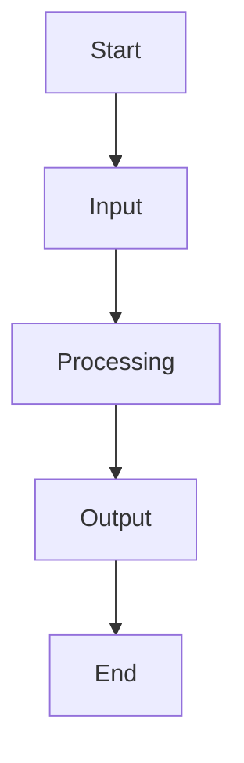

# Assessment-1 Class Test

## Aim

Write the aim here.

## Objective

Write the objective here.

## Algorithm

1. Start.
2. Take the input.
3. Process the input using the selected AI method.
4. Display and analyze the output.
5. Stop.

## Flowchart



## Code

```python
# Add your code here
```

## Output

Add output screenshots or observations here.

## Result

Write the result here.

## Conclusion

Write the conclusion here.
